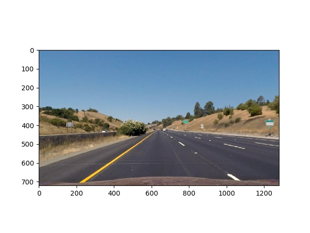
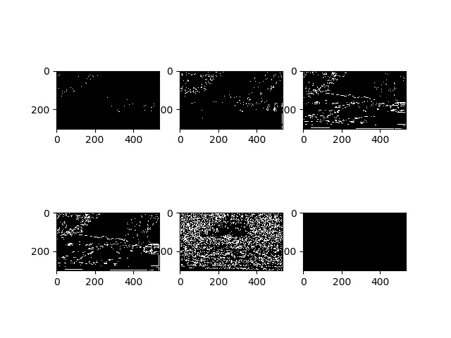

# Lane Detection

### The goals / steps of this project are the following:
- Compute the camera calibration matrix and distortion coefficients given a set of chessboard images. Apply a distortion correction to raw images.
- Use color transforms, gradients, etc., to create a thresholded binary image.
- Apply a perspective transform to rectify binary image ("birds-eye view").
- Detect lane pixels and fit to find the lane boundary.
- Determine the curvature of the lane and vehicle position with respect to center.
- Warp the detected lane boundaries back onto the original image.
- Output visual display of the lane boundaries and numerical estimation of lane curvature and vehicle position.

## 1. Camera calibration
The code for this section refers to `camera_calibration.py`. I start by preparing "object points", which will be the (x, y, z) coordinates of the chessboard corners in the world. In folder "camera_cal", you can find the images for calibration for this project. (folder "iphone_cal" is for testing my iphone camera.)
Here I am assuming the chessboard is fixed on the (x, y) plane at z=0, such that the object points are the same for each calibration image. Thus, `p` is just a replicated array of coordinates, and `points` will be appended with a copy of it every time I successfully detect all chessboard corners in a test image. `corners` will be appended with the (x, y) pixel position of each of the corners in the image plane with each successful chessboard detection. I then used the output `points` and `corners` to compute the camera calibration and distortion coefficients using the cv2.calibrateCamera() function. I applied this distortion correction to the test image using the cv2.undistort() function and obtained this result.

## 2, Pipeline (Single images)

1. To demonstrate this step, I will describe how I apply the distortion correction to one of the test images like this one:

After the calibration, the undistorted version is as below:

2. Create binary image using color transform,, gradient, hsl transform etc. The detailed steps refer to the file `threshold_combining`. The main steps are:
- Absolute horizontal Sobel operator on the image
- Absolute vertical Sobel operator on the image
- Sobel operator in both horizontal and vertical directions for its magnitude
- Sobel operator for getting the direction of the gradient
- Convert the image from RGB space to HLS space, and threshold the S channel
- Combine the above binary images for the final binary image
The results is as below:

3. The code for my perspective transform is for getting a "bird's eye view" of the lane, which includes a function called perspective_transform(). It is in the file `perspective_trans.py`. The perspective_transform() function takes as inputs an image ( img ), as well as source ( src ) and destination ( dst ) points. The source and destination points are hardcoded.

I verified that my perspective transform was working as expected by drawing the src and dst points onto a test image and its warped counterpart to verify that the lines appear parallel in the warped image.

4. Then I use sliding window and let it iterate through `nwindow` to track the curvature. (in `Line.py`)

And I did some other stuff and fit my lanes with a 2nd order polynomial kinda like this: (in `Line.py`)

5. Next step is to add some infomation like radius of the curvature and vehicle position to the image and mark the roi. 
Afterwards, process all the video frams in `process_video.py`
## 3. Here is a link to my video results
https://github.com/AmazYama/Detect_lanes/blob/master/example_images/video_test.mp4

## How to run
1. camera calibration (After run, the coefficients will save into a file for the convienience for processing videos or images.)
`camera_calibration.py`
2. In principle, each of the following files can run individually for testing purpose after the calibration.
`threshold_combining.py`
`perspective_trans.py`
`Line.py`
3. After the calibration,the 2. step can be skipped and jump to this step to process video directly.

## Discussion
- The first difficulty I have met is to find the best threshold for transferring the color image to binary image without losing too much information. This was solved by trying different parameters' setting.
- Around 1 out of 200 frames are still not stable. And this algorithm for the challenge videos is like a disaster. The problem is that when there are several lanes in the frames, the poly-fitting is not working well enough.
- The threshold is hard-coded, which means it can only be used in certain weather and light condition.
